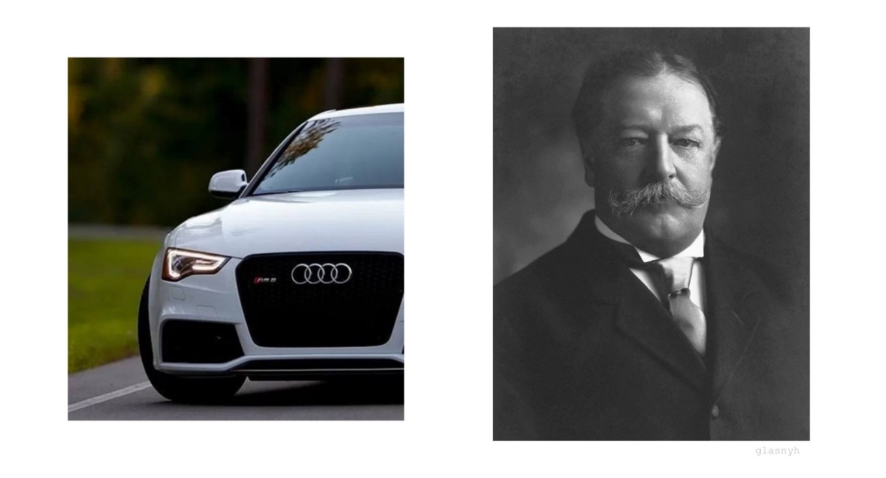

# Ответы квиз-турнира Мир Крипто

**Категории**:
- [Разминка](#разминка)
- [Шифры](#шифры)
- [Даты](#даты)
- [События](#события)
- [Операции](#операции)
- [Места](#места)
- [Люди](#люди)
- [Матрешка](#матрешка)
- [Кроссворд](#кроссворд)

## Разминка

### 1. Где остальное?

Система тайнописи, в которой вместо целой буквы пишется только её характерная часть

**Варианты ответов**:
1. Простая литорея
2. Полусловица
3. Греческая тайнопись
4. Мудрая литорея

**Ответ**: 2

### 2. Это не танец

Выберите верное утверждение

**Варианты ответов**:
1. Salsa20 всегда выполняется за разный промежуток времени
2. Salsa20 проще чем DES
3. Скорость Salsa20 ниже, чем у RC4
4. Salsa20 основан на операциях 32-битного суммирования

**Ответ**: 4

### 3. Следующий уровень

Какие уровни военной разведки существуют?

**Варианты ответов**:
1. Тактический, стратегический
2. Тактический, оперативный, стратегический
3. Тактический, промежуточный, стратегический
4. Тактический, стратегический, тактико-стратегический

**Ответ**: 3

### 4. Много букв

Выберите ответ, в котором органы государственной безопасности записаны в хронологическом порядке

**Варианты ответов**:
1. НКВД, КГБ, НКГБ, МВД
2. НКВД, НКГБ, КГБ, МВД
3. КГБ, НКГБ, НКВД, МВД
4. НКВД, НКГБ, МВД, КГБ

**Ответ**: 4

### 5. Кто лишний?

**Варианты ответов**:
1. Арвид Харнак
2. Рашель Дюбендорфер
3. Отто Пюнтер
4. Георг Блан

**Решение**: Все, кроме Арвида Харнака, являются лидерами подгрупп сети «Красная Тройка».

**Ответ**: 1

### 6. КГБ

Соотнесите главные управления КГБ с функциями, которые они выполняли в 1991 году.

**Формат**: А1Б2В3Г4

А. 1-е ГУ
Б. 2-е ГУ
В. 7-е ГУ
Г. 8-е ГУ

1. Шифровальное управление
2. Внешняя разведка
3. Контрразведка
4. Наружное наблюдение

**Ответ**: А2Б3В4Г1

### 7. Год не подскажите?

В каком году был создан отдел КГБ, отвечающий за прослушивание телефонов и помещений?

**Варианты ответов**:
1. 1959
2. 1967
3. 1972
4. 1973

**Ответ**: 2

### 8. Один, два, много

Сколько ключей использовалось в шифре ВИК?

**Варианты ответов**:
1. 1
2. 2
3. 3
4. 4

**Ответ**: 4

### 9. Интересный логотип

Что является символом Американской Ассоциации Криптограмм?

**Варианты ответов**:
1. Скитала
2. Ключ
3. Шифровальный диск Цезаря
4. Диск Энея

**Ответ**: 1

### 10. Незаменимый шифр

Какой шифр не относится к шифрам замены?

**Варианты ответов**:
1. ROT13
2. Аффинный шифр
3. Решетка Кардано
4. Квадрат Полибия

**Ответ**: 3

### 11. Ох, уж этот Цезарь

С помощью какого шифра зашифровано сообщение: эгывебхгтжыс?

**Варианты ответов**:
1. ROT11
2. ROT19
3. ROT13
4. ROT22

**Ответ**: 2

### 12. Наружное наблюдение

В каком году была создана Служба внешней разведки Российской Федерации?

**Варианты ответов**:
1. 1939
2. 1965
3. 1983
4. 1991

**Ответ**: 4

### 13. Что было раньше?

Какой алгоритм является предшественником алгоритма DES?

**Варианты ответов**:
1. Lucifer
2. AES
3. DESX
4. Blowfish

**Ответ**: 1

### 14. Просто космос

Когда запустили советский спутник космической системы разведки «Космос-954»?

**Варианты ответов**:
1. 24 января 1978 г.
2. 18 сентября 1977 г.
3. 12 ноября 1983 г.
4. 17 января 1991 г.

**Ответ**: 2

### 15. Полезно знать

Что такое spyware?

**Варианты ответов**:
1. Антивирусная программа
2. Шпионское оборудование
3. Подслушивающее устройство
4. Вредоносная программа

**Ответ**: 4

### 16. Чужой среди своих

Что лишнее?

**Варианты ответов**:
1. Операция «Антенна»
2. Операция «Туман»
3. Операция «Снег»
4. Операция «Тарантелла»

**Решение**: Все операции, кроме операции «Снег», основаны на радиоигре.

**Ответ**: 3

### 17. Страх для перфекциониста

Какой алгоритм является ассиметричным?

**Варианты ответов**:
1. Elgamal
2. Blowfish
3. IDEA
4. RC2

**Ответ**: 1

### 18. 4 даты - 4 шпиона

Сопоставьте даты и года жизни Советских Шпионов

**Формат**: A-1, B-2, C-3, D-4

A. Александр Михайлович Коротков
B. Николай Михайлович Транкман
C. Юрий Михайлович Феличкин
D. Борис Николаевич Мельников

1. 1904 - 1992
2. 1896 – 1938
3. 1909 - 1961
4. 1896 – 1990

**Ответ**: А-3, B-4, C-1, D-2

### 19. Профессиональный праздник

У каждой профессии есть свой профессиональный праздник. Какого числа празднуется день шифровальщика?

**Варианты ответов**:
1. 17 ноября
2. 5 мая
3. 23 февраля
4. 13 апреля

**Ответ**: 2

### 20. Патент на криптомашину

Он работал в шведской компании по разработке криптомашин. Выберите номер изобретения, которое он запатентовал

**Варианты ответов**:
1. Патент № 52987
2. Патент № 58278
3. Патент № 52279
4. Патент №58345

**Ответ**: 3

## Шифры

### 1. Авангард

Это напоминает какой-то шифр…


**Ответ**: Пляшущие человечки

### 2. Имя Розы

Ответ на английском языке


**Решение**: У нас есть совсем немного информации: какие-то символы, похожие на знаки зодиака и название задания. Гуглим название и выясняем, что это название книги. Ищем в книге упоминание о зодиакальных символах и находим описание некой “самой распространенной азбуки: Солнце – А, Юпитер – В… ”. С помощью Яндекса удаётся найти полный вариант зодиакальной азбуки. Расшифровываем и получаем ответ.

**Ответ**: Confidential / confidential

### 3. Глухой телефон

Иногда даже, по расшифрованному сообщению, сложно понять его смысл, но, думаю, вы сможете написать название того, о чём идёт речь.


**Ответ**: Фиалка

### 4. Шифр Плейфера

Описание: Здесь зашифрован текст знакомый многим,

```AWATUKAGFAMBDHNABRWCLNUFQBHBPGGKFNVACOZKNDFDMKKGWBFMOTPKLNLWSPCOKMSOALBMDNMDCVCTKDLECGOEBMELSMFMCGLZWULBAVBHWB```

Вопрос, в каком году это произошло?

Attackatdown

**Решение**: через шифр Плейфера используя ключ Attackatdown
```TODAY AT FOUR OCLOCK IN THE MORNING WITHOUT ANY DECLARATION OF WAR THE GERMAN ARMED FORCES ATXTACKED THE BORDERS OF THE SOVIET UNION```
Гуглим, получаем 1941

**Ответ**: 1941

### 5. Морзянка

Здесь зашифровано какое-то послание, сможешь узнать ФИО этого человека?

**Формат**: Имя Отчество Фамилия

```-.. --- / ... .. .... / .--. --- .-. / .--. . .-. . -.. / --. .-.. .- --.. .- -- .. / ... - --- .. - / ... - .-. .- ---- -. .- .-.- / -.- .- .-. - .. -. .- .-.-.- .-.-.- .-.-.- / -. .- / -.. -. . / .-.. --- --.- .. -. -.-- / ..- .-- .. -.. . .-.. .. / .-. .- --.. -... .. - ..- ..-- / --. .-. ..- --.. --- .-- ..- ..-- / -- .- ---- .. -. ..- .-.-.- / .-- --- -.- .-. ..- --. / .-.. . ...- .- .-.. --- / -... --- .-.. . . / -.. .-- ..- .... / -.. . ... .-.- - -.- --- .-- / - .-. ..- .--. --- .-- .-.-.- .-.-.- .-.-.- / --- ... --- -... . -. -. --- / .-- .-. . --.. .- .-.. --- ... -..- / .-- / .--. .- -- .-.- - -..- / .-. .- ... .--. .-. --- ... - . .-. - --- . / -. .- / --.. . -- .-.. . / - . .-.. --- / -- .- .-.. . -. -..- -.- --- .--- / -.. . .-- --- ---. -.- .. / .-- / .-. --- --.. --- .-- --- -- / .--. .-.. .- - -..- .. -.-. . --..-- / ... / .--. -.-- ---- -. -.-- -- .. / ... .-- . - .-.. -.-- -- .. / .-- --- .-.. --- ... .- -- ..```

**Решение**: декодируем морзянку, гуглим цитату, получаем ответ

**Ответ**: Михаи́л Влади́мирович Фёдоров

### 6. Странный шифр

Нам прислали кусочек странного послания. Известно лишь то, что этот человек участвовал в масштабной операции.
Укажите ту самую операцию


**Решение**: расшифровываем шифр пляшущих человечков, в данном шифре нам известно о человеке немногое, но с помощью этого находим самого человека, а прочитав больше находим ту самую операцию

**Ответ**: Операция «Монастырь»/Операция Монастырь/Монастырь.

### 7. Шифрование - наше все

Нам прислали странное сообщение. Известно лишь то, что сообщение взято из раздела “Артиллерия”. Помогите нам его расшифровать и понять о чём идет речь.

Ключ к разделу: $x^2-3x-10=0$

Жфйхжай фуршьйт уёхемйы хепйча ж фуртуо пусфрйпчеынн. Нмшьйтнй уёхемые ж мтеьнчйрбтуо цчйфйтн цфуцуёцчжшйч цупхеюйтнг цхупуж хемхеёучпн етерузньтузу уёхемые н мечхеч фу тнс.

**Решение**: решаем квадратное уравнение и получаем два корня $x_1=-2$ и $x_2=5$, в нашем случае ключ 5, то есть сдвиг на 5, и расшифровываем шифр цезаря, осинтим данное послание и вуаля переходим по первой ссылке и ищем, о каком снаряде идет речь.

**Ответ**: Артиллерийский зенитный снаряд/Артиллерийский зенитный снаряд, обладающий высокой степенью поражения движущихся целей

### 8. Технари

В годы Второй мировой войны сражения шли не только на поле боя, но и в научных кругах.

Шли ожесточенные бои между Советским Союзом и Германией, параллельно этому США не прекращали работу над новым видом вооружения, ядерным оружием, которое дало бы господство над всем миром. Со стороны Советского Союза были разведчики, которые занимались добычей научных и технических секретов.

Определите дату, когда ученый передал портфель со сверхсекретной информацией разведчику Жлжтчщ.


**Решение**: Расшифровываем с помощью квадрата Полибия имя разведчика
Как работает шифр: Для шифрования на квадрате находили букву текста и вставляли в шифровку нижнюю от неё в том же столбце. Если буква была в нижней строке, то берем верхнюю из того же столбца.

**Ответ**: 23.02.1944

### 9. Войны сетей

Найдите псевдоним советского разведчика, который вошел в группу людей антинацистского движения. Он прибыл в один из городов Европы, чтобы встретиться с человеком, который возглавлял группу, названную его именем. Этот человек был руководителем антинацистского движения в годы второй мировой войны. Красочное название этому движению дали сами немецкие разведчики.

Расшифруйте два слова и, восстанавливая хронологию, найдите псевдоним.


**Решение**:


«Красная капелла»
Чтобы расшифровать красочное название нужно перевести числа из двоичного кода в десятичный. После найти связь между числами и алфавитом. Далее перенести в алфавите каждую букву на количество символов, указанное под буквой.

**Ответ**: Кент

### 10. Почти Малевич
В ходе раскопок наши археологи нашли труды `%D0%9F%D0%BE%D0%BB%D0%B8%D0%B1%D0%B8%D0%B9` помоги понять, что он хотел нам сказать

```42 24 31 11 13 34 31 24```

**Решение**: Подсказка в условии зашифрована при помощи URL, что видно наглядно, там написано Полибий. По запросу Полибий криптография получаем его метод «квадрат Полибия». Далее в онлайн калькуляторе расшифровываем сообщение, квадрат 5*5 поэтому в алфавит входят первые 25 символов русского алфавита

**Ответ**: Сила Воли

### 11. Рамзай

В наши руки попало зашифрованное сообщение из Японии, а у нашего криптографа сегодня выходной, мы ему звонили, но он сказал только странные слова: «Ключ: SUBWAY, анаграмма: MCRIPTOS» и сбросил трубку. Поможешь расшифровать?

**Формат**: `MirCrypto{FLAG/FLAG…}`

```59460 94960 93124 97865 93209 38694 096```

**Решение**: Сначала нужно найти алгоритм шифра Рамзая по ключу и анаграмме. Алгоритм: Составляем таблицу по ключу и анаграмме: сначала записываем ключ, потом по порядку буквы английского алфавита, не вошедшие в ключ, затем нумеруем буквы по столбцам в порядке встречи их в анаграмме.


Составляем таблицу перевода букв в коды:


Первая строка: 1 буква – 1 цифра, вторая и третья строка: 1 буква – 2 цифры.
Шифруем\расшифровываем сообщение «RAMSAYS/CIPHER/IS/EASY» по таблице, разделяя цифры на блоки по 5. Получаем:


**Ответ**: `MirCrypto{RAMSAYS/CIPHER/IS/EASY}`

### 12. «Остаток от деления» в школе проходят?

Наши агенты пытались прислать секретное сообщение, но они были скомпрометированы, им пришлось в спешке убегать. Работая на новенькой М-100 «Спектр», они успели оправить сообщение, но не успели отправить таблицу кодов, пришла лишь часть. Поможешь расшифровать?

**Формат**: `MIRCRYPTO{FLAG}`


```YQFEFTBJ}MITECMS{{SJHQSOWXP{ZVEVKFIP_NSXCGAI}WK```

**Решение**: Сначала нужно догадаться, что гамма – это MIRCRYPTO


**Ответ**: `MIRCRYPTO{ACCORDING_TO_THE_PRECEPTS_OF_VOLOSOK}`

### 13. Miracle

У древних программистов во времена палеозоя байт был по 7 бит
155 38 148 58 86 104 84 159 238 108 26 85 162 204 167 126 124 107 245 36 69 191 10 76 232 52 172 223 167 102 157 72 179 105

**Формат**: `MIRCRYPTO{FLAG}`

Ответ: `MIRCRYPTO{MARVELS_OF_THE_BINARY_SYSTEMS}`

Решение: Решение состоит в том, что исходное сообщение было сначала закодировано по таблицы ASCII по 7 бит и записано подряд. Затем полученное сообщение раскодировали, но брали уже по 8 бит. Для дешифрования нужно проделать обратные действия. Можно вручную, можно программой. Пример программы для шифрования\дешифрования:

### 14. Странный файл

Нашим хакерам удалось перехватить интересный файл, передававшийся секретному каналу. Это должна быть важная информация о противнике. Но с этим файлом что-то не так. Можете ли вы помочь с открытием?

**Формат**: `mircrypto{abcdefghijklmnopqrstuvwxyz_13457}`

**Решение**: Открываем файл через HxD. Видим первые 4 байта: «50 4B 03 04». Узнаём, что такая сигнатура принадлежит архиву с расширением .zip. Переименовываем файл, добавляя на конце необходимое расширение. Получаем архив, в котором лежит размытое изображение флага. Если будет проблематично разобрать, можно будет «поиграть» с резкостью или контрастом. Вводим флаг.

**Ответ**: `mircrypto{4rch1v3_51gn47ur3}`

### 15. Как у вас со стеганографией?

Вот вам файл, всё просто.

**Формат**: `MirCrypto{Flag}`


**Решение**: Достаточно открыть файл в режиме просмотра спектрограммы:


**Ответ**: `MirCrypto{My_first_stego!}`

### 16. Два квадрата

```ЯХАМЮЙШ8ЬПБ2ПЛ2У3ЭШЖОЮБ2З1Ф_Ж_ХМУРЕБПЛХМЗ1ТЩК9ЦЦШЛЕЮ.1ЮБХБ9ЗБ2,ЗБ2.2ПШХЙФ1ЧЙЦЩ```


**Формат**: Название организации

**Решение**: с помощью шифра двойной квадрат расшифровываем текст, получаем: С 1812 года контроль за работой русской разведки осуществляла эта организация

**Ответ**: Особенная канцелярия

## Даты

### 1. Полет

Это устройство может быть применено для засекречивания каналов, образованных на любой аппаратуре. Это устройство связано с животным, которое в старину называли 24-10-6-23-1. В титрах к каждому эпизоду мультсериала приводится криптограмма. Эпизоды 14-19 используют этот шифр. Когда оно было создано?

**Решение**: не трудно догадаться, что это мультсериал Гравити Фолз, и в данных эпизодах используется шифр A1Z26, получаем слово «циеха», находим, какое животное в старину называли циехой. Видим, что это синица. Узнаём в каком году была создана аппаратура синица.

Очень тяжело найти именно дату создания «СИ-15», но можно найти информацию о том, что оно было создано к началу ВОВ. Так что год создания можно угадать. Все остальное гуглится отлично, проблем не возникает.

**Ответ**: 1941

### 2. Здесь замешана стеганография

Именно этой высшей государственной наградой посмертно наградили выдающегося советского разведчика-нелегала. В ответе укажите дату его рождения. Используйте фотографию.

**Формат**: дд.мм.гггг


**Решение**: Открыв изображение с помощью блокнота, в конце файла найдем прозвище шпиона – Рамзай. Отсюда легко найти, что это был Рихард Зорге и его дату рождения.

**Ответ**: 04.10.1895

### 3. Ребусы

Отгадайте в каком году было создано это?

**Решение**: первая картинка это – РОС, вторая это – НАЗ. Это РОСНАЗ.

**Ответ**: 1941

### 4. Бывают и неудачи

Эта пара советских разведчиков, передавших ядерные секреты, была поймана в результате американского контрразведывательного проекта, связанной с дешифровкой советских шифрованных сообщений. Когда начался этот проект?


**Формат**: дд.мм.гггг

**Решение**: Поиск по фото выдает что это Этель и Юлиус Розенберги. Дальше легко найти проект «Венона», в результате которого их разоблачили, и дату его начала.

**Ответ**: 01.02.1943

### 5. Рыбаки

В каком году возникла необходимость в использовании подобных кораблей?


**Решение**: поиск по фото приводит к статье о морской радиоразведке. Запрос «в каком году зародилась морская радиоразведка» приводит к ответу

**Ответ**: 1951

### 6. Солнечная страна

Этого разведчика направили в страну на фото, потому что он знал два восточных языка. В каком году это было?


**Формат**: гггг

**Хинт**: متولد Aşkabat'ta

**Решение**: в хинте зашифровано «Рождённый в Ашхабаде» на персидском и турецком языках соответственно. Производя запрос «Какой разведчик родился в Ашхабаде», понимаем, что речь идёт Георгии Агабекове. Затем поиск по фото приводит нас к стране Ташкент. Ищем в биографии Агабекова в каком году его перевели в Ташкент получаем ответ.

**Ответ**: 1922

### 7. Любитель записок

Со словами «до настоящего времени работал честно и преданно для советской России» он бежал на Запад. В каком году это произошло?

**Формат**: ГГГГ

**Решение**: производим поиск по фразе и делаем вывод, что речь идёт об Агабекове. Далее по запросу «в каком году он бежал на Запад» находим ответ.

**Ответ**: 1930

### 8. Освобождение

Он вернулся в СССР в результате долгих переговоров. Когда это произошло?

```18-21-5-16-13-30-22 1-2-6-13-30```

**Формат**: дд.мм.гггг

**Решение**: Заметив, что каждое число отвечает за определенную букву, расшифруем сообщение шифром A1Z26, получим имя – Рудольф Абель. В интернете узнаём, что Рудольфа Абеля обменяли на двух американцев 10 февраля 1962 года.

**Ответ**: 10.02.1962

### 9. Специальный отдел

После установления власти большевиков возникла проблема сохранения тайны при передаче оперативных сообщений. Для решения этой проблемы был создан специальный отдел, который позже стал самым крупным и технически оснащенным органом радиоразведки в мире. Укажите дату создания этого отдела.

**Формат**: дд.мм.гггг

**Решение**: Ищем в интернете специальный отдел радиоразведки СССР и находим, что это Спецотдел ВЧК.

**Ответ**: 05.05.1921

### 10. Я родилась

В некотором Министерстве пришли к выводу о том, что необходимо создать Особый отдел Высшего Чабанского Краснознаменно-Гагаузского паспортного Управления, который стал основой рцохшфицёъоэкчроы салата чсщмж Кардини 6 России. Определите дату образования отдела.

**Формат**: дд.мм.гггг

**Решение**: Салат Кардини 6 – шифр цезаря со свдигом 6 вправо, получим рцохшфицёъоэкчроы чсщмж – криптографических служб Высшего Чабанского Краснознаменского-Гигантского Паспортного Управления – ВЧК-ГПУ. Поиск даты по данной информации приводит нас к 5 мая 1921

**Ответ**: 5.05.1921

### 11. Награда

Успешный и состоятельный советский разведчик, его задачей был сбор информации об американских и британских базах. На одном из его предприятий разработали «XXXXXXXXXXX XXXXX» и за это он был награжден медалью. В каком году это было?

```••−•• •−•• • −•− − •−• −−− −• −• −•−− •−−− −−•• •− −− −−− −•−```

**Решение**: Расшифровываем данный текст и получаем «электронный замок», за него Молодый Конон Трофимович и получил в 1960 году золотую медаль на выставке в Брюсселе.

**Ответ**: 1960

## События

### 1. Проблема

Этот день называли «судным». Предсказывали, что откажет электроника. На решение этой проблемы потратили миллиарды. Назовите эту проблему.

**Решение**: Ищем решение по ключевым словам: «судный день», «откажет электроника», «на решение проблемы потратили миллиарды», «проблема».

**Ответ**: 2000

### 2. Ба-бах

Этот человек, создавший один из надежных шифров, увлекался и модернизацией морских мин. Укажите название события, во время которого этот человек смог воспользоваться своей разработкой.

**Решение**: При поиске словосочетания «морские мины» просматриваем биографии людей, которые занимались разработкой морских мин. Павел Шиллинг кроме морских мин как раз является создателем секретного шифра. В 1812 году во время Отечественной войны Павел разработал электрический взрыватель подводной мины и в том же году успешно осуществил подрыв подводного фугаса с помощью электрического тока от батареи.

**Ответ**: Отечественная война

### 3. KeepCalm

Что произошло после того, как главный чекист 20 века ev lcznv jo oev cqvwrt zy oev Pvwoijq Pztthoovv? А=3 В=9

**Решение**: По результатам поиска «Кто главный чекист 20 века» понимаем, что речь идёт о Феликсе Дзержинском. Поиск по фотографии указывает на Афины. Следовательно, это аффинный шифр, коэффициенты А и В заданы. Зашифрованное сообщение «выступил на пленуме ЦК». Запрос с использование всех расшифрованных составляющих приводит к ответу.

**Ответ**: смерть Дзержинского

### 4. Это прорыв

Мне прислали зашифрованное сообщение в виде волшебной ленты. Сказали, что простое устройство для записи текстовой информации поможет расшифровать его. А у Вас не найдётся такого поблизости?
Ещё сказали, что лента длинной должна быть с лист А4, а шириной – не более 1 см.

```ПРНРИОАИИИЯДЛП_ВИОТ_ЛО_О_Е_МГ_НИИР_ИЗРА_ЕМ_Ф__ЕК```

**Решение**: Если у участников есть печатный вариант, то им просто надо вырезать эту «ленту» и намотать на ручку/карандаш. Если нет, то её можно самому нарисовать и вырезать.

**Ответ**: появление радио

## Операции

### 1. Степи

Контрразведка не дремлет! В результате какой операции поймали человека справа?


**Решение**: По поиску фотографии находим оригинал и человека с фотографии – Басанг Бурунович. Он был руководителем 4-х диверсантов, которые были пойманы при проведении операции «Арийцы».

**Ответ**: Арийцы

### 2. Мистер Х

На обучение Х потратили около 25 млн. долларов. На первой же операции Х сбило такси, после чего ЦРУ пришли к выводу, что Х не очень интересуется задачами национальной безопасности. Когда узнаете, кто скрывается за Х, напишите название этого проекта на английском языке.

**Решение**: В 60-е ЦРУ создало «шпионских котов», которых тренировали в рамках холодной войны с СССР. Проект получил название Acoustic Kitty. Коты должны были следить за советскими послами в США.

**Ответ**: Acoustic Kitty/Acoustic kitty

### 3. Кошки-мышки

Была у Германии организация специальная: разведка, диверсия – всем занимались. Даже покушение на Сталина замышляли! Так ещё и способом киношным – взорвать пушкой, привязанной к руке. Но шпиона поймали, и до конца войны от его имени писали в Германию – отдельной операцией это назвали. Не напомните, что за операция такая?

**Формат**: Название операции

**Решение**: Можно пойти лёгким путём – искать покушения на Сталина и найти данный вариант, а по имени исполнителя – Петр Таврин, и саму операцию. Можно искать именно организацию и найти организацию Цеппелин

**Ответ**: Туман

#### 4. Кря
Именно этот человек был причастен к убийству человека, которому был присвоен данный орден. Дайте название операции по реализации убийства этого человека.

```06DTj9Cx0LLQty7Qh9Ci0JjRqtCG0b/Rs9Gj0ZfRjdOBwrjSstOw07zToNOK0bHRjtKk0bfRlw==```

**Решение**: Сначала нам нужно расшифровать сообщение, находим один из популярных шифров – RC4. Получаем Павел Анатольевич Судоплатов, деятель советских спецслужб, разведчик. Далее сравниваем, кому был присвоен данный орден и биографию Судоплатова понимаем, что он был причастен к убийству Льва Троцкого. Операция по убийству Льва Троцкого носит название «Утка».

**Ответ**: Операция Утка / Утка.

### 5. Вот это дружба

Анна, Люси и Ольга были очень хорошими друзьями. Благодаря их разведке пантера получила известность. К какой операции относится данная информация?

**Решение**: Поиск по пантере выдаёт очень много информации. Остановимся на танке «Пантера».
Ищем информацию про их совместную разведку пантеры. Узнаём, что Люси – это Рудольф Ресслер, который передал советскому командованию информацию о танке «Пантера». И информация задания относится к операции «Цитадель».

**Ответ**: Цитадель

## Люди

### 1. Теорема

Он может много чем похвастаться. Секретная телеграфная и телефонная связь не предел. Он стал знаменит во всем мире. Назовите его. В ответе напишите его фамилию.

**Решение**: При поиске в интернете создание секретной телефонной и телеграфной связи, а также при помощи подсказки в названии задания приходим к человеку по имени Котельников, который внес огромный вклад как в годы Великой Отечественной Войны, так и послевоенные годы.

**Ответ**: Котельников

### 2. Дарт Вейдер

Этот человек узнал и сообщил об американском проекте под названием «Йдзйёпэж дрлпэ», закодированным шифром TOR2, направленном против СССР в конце Чрнрёпрл дрлпэ. Как звали этого человека?

**Решение**: узнаём, что шифр не TOR2, а ROT2, расшифровываем слова («Звёздные войны» и «холодной войны»). Ищем того, кто узнал о данном проекте и находим: «Полковник К.», а им был Владимир Иосифович Лохов.

**Ответ**: Владимир Иосифович Лохов

### 3. Агент

Томазин? Много ли мы знаем об этом человеке? Или он просто использовал надёжные шифры? На кого он работал? На русских? Вы должны узнать фамилию человека, на которого работал Томазин.

**Решение**: Так, если мы будем искать этого человека по фамилии, то мы вряд-ли что-то найдём. Но вот если будем искать «Томазин шифрование» или «Томазин шифруется» и т.п., то наткнемся на «Историю шифровального дела в России» и узнаем, что Томазин был агентом Неплюева, который был русским адмиралом, дипломатом.

**Ответ**: Неплюев

### 4. Синий и Красный

Группа специалистов во главе с этим человеком, смогла предотвратить внезапную атаку Японских сил на Советский союз, взломав шифр и узнав об атаке заранее. как звали этого человека?

**Формат**: Фамилия Имя Отчество

**Решение**: гуглим японские машинки для шифрования. затем ищем кто занимался их взломом, находим Сергея Семёновича как руководителя группы дешифровщиков

**Ответ**: Толстой Сергей Семёнович

### 5. Грустный саксофон

На данном изображении изображена группа, через 5 лет после основания которой, в СССР прибыл еще один человек. У него, в свою очередь имелись заметки, зашифрованные собственным шифром, благодаря которому получилось обмануть КГБ. Как звали этого человека и на чем был написан шифр?


**Формат**: Имя Отчество: Вещь

**Решение**: Ищем картинку из вложения в интернете, находим название Klezmer Conservatory Band. ИщемKlezmer Conservatory Band + 1985 год , читаем статьи находим ответ

**Ответ**: Меррил Голдберг: Ноты

### 6. Где логика?

Какое кодовое имя она получила, помогая разведке Советского Союза?


**Решение**: На первом фото мы видим Елизавету 2 (Elizabeth), а на втором фото – автомобиль Bentley. Соединяем две картинки и получаем имя разведчицы Элизабет Бентли, которая получила от советской разведки кодовое имя «Умница».

**Ответ**: Умница

### 7. НЕ воспринимайте БУКВАльно

Назовите его имя и фамилию.

```ДД.ОДЯЖ°, ЕА.ВЗИБД°```

**Решение**: Запись букв напоминает запись координат. Заменим буквы на цифры в соответствии с их порядковыми номерами в алфавите. Получим координаты 55.165338°, 61.391025°, которые указывают yf расположение памятника разведчику Исхаку Ахмерову.

**Ответ**: Исхак Ахмеров

### 8. Посылка с грифом секретно

Нужно срочно передать эти паспорта нашему агенту. Напомните его настоящие имя и фамилию.


**Решение**: В паспортах вместо имени написаны псевдонимы этого агента. Найдем, что под псевдонимами Wise и Stuart работал Дональд Маклейн. Также можно дойти до верного ответа с помощью даты рождения и страны.
Поиск даты по данной информации приводит нас к 5 мая 1921.

**Ответ**: Дональд Маклейн

### 9. Разведчик или музыкант

Проведите связь между аудиофайлом и фотографией. Скажите, о какой личности идет речь и какой группой он руководил в годы Великой Отечественной войны.

**Формат**: Фамилия, Название группы


**Решение**: На фотографии мы видим город Цюрих (хинт), что находится в Швейцарии. Анализируя аудио, понимаем с помощью подсказки (смотри на обложку), что не придется слушать аудио, ответ в авторе и названии.
В итоге получаем разведывательную группу «Дора», которая действовала на территории Швейцарии во вторую мировую, а руководителем ее был Александр Радо.

**Ответ**: Радо, Дора

### 10. Любитель почитать

Это ведомство занималось делами контрреволюции в странах Антанты. Её руководитель завербовал человека, который связан с рсъипх. Кто это?

**Формат**: Фамилия Имя Отчество

**Решение**: Ведомство, которое занималось контрреволюциями – Всероссийская чрезвычайная комиссия по борьбе с контрреволюцией и саботажем, один из её руководителей Дзержинский. Зашифрованное слово «деньги», которое зашифровано путём сдвига на 13. Хинт зашифрован при помощи двоичного кода, а именно СВР. Исследуя историю СВР, видим, что Дзержинский завербовал Филиппова А.Ф., который был издателем газеты «Деньги».

**Ответ**: Филиппов Алексей Фролович

### 11. Поэт

Назовите фамилию этого разведчика. ***** щит и меч третьего рейха


**Решение**: На рисунке изображен максимум функции. Щитом и мечом третьего рейха была организация «Абвер». Необходимо осуществить поиск «Макс в Абвере».

**Ответ**: Демьянов

### 12. Нож в спину

В 1976 году разведчик перебрался в Перу. Спустя время он стал жертвой предательства бывшего полковника СВР Александра Потеева. Назовите его полный псевдоним, под которым он работал в данной стране.

**Решение**: ищем советского разведчика, работавшего в Перу в 1976 году. Находим Михаила Васенкова, а затем и его псевдоним.

**Ответ**: Хуан Хосе Ласаро Фуэнтес

### 13. Жизнь – это моменты, когда захватывает дух


```
48.292066, 25.935180 - 50.103618, 14.394676 - 52.512012, 13.324782 – 52.512012, 13.324782 - 48.856662, 2.351556 - 51.507336, -0.127709 - 38.899513, -77.036527 - 55.755863, 37.617700
```

**Формат**: Фамилия Имя Отчество

**Решение**: по фотографии определяем персонажа Джек, после ищем места, в которых он был, дальше понимаем, что это разведчик, а Джек прозвище, находим имя и фамилию.

**Ответ**: Черняк Ян Петрович

### 14. Нелицеприятный человек

Его квартира была ограблена в 2003 году. Он был образцовым разведчиком «Богом разведки», пока как-то раз не положил на стол личное дело советского разведчика-нелегала в комнате для допросов ФБР. Тем самым раскрыв настоящее русское имя гражданина Уругвая. Назовите фамилию предателя.

**Решение**: Ищем список самых известных предателей СССР и России. Ищем информацию про советских шпионов, имевших гражданство Уругвая. Выясняем, как они были обнаружены.

**Ответ**: Потеев

### 15. Писатель-шифрователь

Определите ФИО специалиста по криптографии во 2-ой мировой войне. За хорошую работу с алгоритмами в области дешифрования он был удостоен ордена «Знак Почета». XOR.

**Формат**: Иванов И.И.


**Решение**: Поиск в интернете нам выдает множество специалистов в области криптографии, которые имеют «Знак Почета». Использование XOR, значит мы должны обратится к разделу электроники и с помощью шифра Вернера расшифровать данное сообщение. Если все сигналы равны между собой (0-0 или 1-1 или 0-0-0 и т.д.), то на выходе получаем 0. Если сигналы не равны (0-1 или 1-0 или 1-0-0 и т.д.), то на выходе получаем 1.Потом, чтобы расшифровать исходник нам нужно перевести ключ и непроизвольные числа в двоичный вид и сложить. После того, как мы сложим двоичные числа и в двоичном коде получим исходник, переводим его в десятичную систему и получаем Фамилию специалиста по криптографии на Японском направлении Толстой С. С.

**Ответ**: Толстой С.С.

### 16. Конструктор

Назовите фамилию главного конструктора этого шифровального устройства.


**Решение**: Понять, что на картинке изображен спектр. Осуществить поиск по словам «устройство», «шифрование», «спектр» и найти создателя устройства «М-100 Спектр».

**Ответ**: Шарыгин.

### 17. Время первых

Используя знания Пушкина, которые он приобрёл благодаря фон Канштадту, некто зашифровал часть нашего вопроса.
Кто первым опубликовал

```(11/5 1/8 ф 1/2) (14/5 7/14 2/15) (1/1 13/2 1/2 5/10 1/1 7/2 15/2 10/19 4/20)```

**Формат**: Имя Отчество Фамилия

Прощай, письмо любви! прощай: она велела.
Как долго медлил я! как долго не хотела
Рука предать огню все радости мои!..
Но полно, час настал. Гори, письмо любви.
Готов я; ничему душа моя не внемлет.
Уж пламя жадное листы твои приемлет…
Минуту!.. вспыхнули! пылают — легкий дым
Виясь, теряется с молением моим.
Уж перстня верного утратя впечатленье,
Растопленный сургуч кипит… О провиденье!
Свершилось! Темные свернулися листы;
На легком пепле их заветные черты
Белеют… Грудь моя стеснилась. Пепел милый,
Отрада бедная в судьбе моей унылой,
Останься век со мной на горестной груди…

**Решение**: Связь между стихотворением и цифрами указывает на использование одного из видов книжного шифра. Хинт наводит на мысль о координатах, собственно говоря, так и есть. Цифры указывают на номер строки и буквы. Полностью вопрос звучит как «Кто первым опубликовал шифр для переписки». Производя запрос в интернете получаем ответ.

**Ответ**: Иван Иванович Голиков

### 18. Архив

В [архиве](assets/people/archive.7z) спрятаны два слова. Составьте из них словосочетание.

**Решение**: Участнику предоставляется архив с паролем. Пароль можно сбросить онлайн бесплатно. Внутри два файла. Первый, текстовый, содержит много иероглифов, которые просто набивают файл. Среди них можно увидеть явно отличающиеся символы. В Word вставляем содержимое файла и удаляем все лишние иероглифы (заменяем их на точку, например). Останется строка «#FF0000». Посмотрев в интернете, можно узнать, что это обозначение красного цвета. Итого первое слово «красный». Во втором файле картинка в очень плохом качестве, к тому же подвержена инверсии. Онлайн можно её инвертировать и попробовать найти в интернете. Запрос картинкой инвертированного изображения выдаст «капелла в Санкт-Петербурге». Отсюда второе слово «капелла». Следовательно, ответ: Красная капелла

**Ответ**: Красная капелла

## Матрешка

### 1. Разведчик-нелегал ч.1

Какую должность он занимал на своём первом рабочем месте?

**Формат**: слово_слово

**Решение**: Для начала посмотрим все задания. Если приглядеться, можно заметить обрывки ссылки, соберём её в правильном порядке и перейдём. По ссылке открывается картинка


 
По названию ссылки понимаем, что это шифр гласных букв. Почитаем, что он из себя представляет и составим дешифровальную таблицу.


После расшифровки послания получим:

«Эти картинки что-то объединяет. И всё связано с ним. Второе – разведывательная группа. Третье – год его рождения. Четвёртое – город, в котором он родился».

Теперь с помощью этой информации решим ч.2-ч.4.

Затем, используя ответы из ч.2-ч.4, узнаем, что нужный нам разведчик – Ян Петрович Черняк. Поискав информацию о его работе, находим, что первое место его работы – небольшой завод в Праге, где он занимал должность инженера-экономиста с 1931 по 1933 год.

**Ответ**: инженер_экономист

### 2. Разведчик-нелегал ч.2


**Решение**: Мы знаем, что нужно найти общее среди картинок и что должно получиться название разведывательной группы. На картинке: батарейка-крона, крона дерева и чешская крона.
3. Разведчик-нелегал ч.3 ЯНА 40 баллов
 
**Ответ**: Крона

### 3. Разведчик-нелегал ч.3



**Решение**: Мы знаем, что нужно найти общее среди картинок и что должен получиться год рождения этого разведчика. Первая картинка отсылает к компании Ауди, которая была основана в 1909 году. На второй картинке – Уильям Тафт, который в 1909 году стал 27-м президентом США.
 
**Ответ**: 1909

### 4. Разведчик-нелегал ч.4


**Решение**: Мы знаем, что нужно найти общее среди картинок и что должен получиться город, в котором родился этот разведчик. Поиск по картинкам сразу же помогает понять, что это Черновцы (Черновицы).
 
**Ответ**: Черновцы/Черновицы

## Кроссворд

### 1. КриптоКроссворд 1

Вам предлагается решить данный кроссворд, чтобы разгадать шифр. Ответ введите строчными буквами.

```9 – 8 8 – 10 7 – 5 9 – 1 4 – 7 3 – 5 5 – 6 10 – 4 1 – 11```


**По горизонтали:**
1. Проверка данных на подлинность.
3. Создание процедуры, позволяющей вызывать отклонения информационного процесса, защищенного использованием криптосистемы, от условий его нормального (штатного) протекания.
8. Исследование информационных систем с целью изучения её скрытых аспектов.
9. Преобразование данных произвольного размера в строку фиксированной длины, состоящую из цифр и букв, при помощи определённого алгоритма.
10. Результат операции шифрования.

**По вертикали:**
2. Свойство объекта (предмета, документа, события), сущность которого представляет собой государственную или служебную тайну и скрывается от посторонних лиц с помощью специальных мер технического, административно-правового и оперативного характера.
4. Процесс получения информации из зашифрованной, не обладая ключом.
5. Способность криптографического алгоритма противостоять попыткам взлома.
6. Попытка злоумышленника вызвать отклонения от нормального протекания информационного процесса.
7. Процесс случайного создания.
 
**Решение**:
Применяя свои знания и интернет, участники разгадывают кроссворд, а затем, используя кроссворд в качестве ключа, дешифруют последовательность пар чисел по принципу: первое число – номер слова, второе число – номер буквы по порядку.

**Ответ**: алохомора.

### 2. КриптоКроссворд 2


Используя ответ на предыдущее задание, определите, что здесь написано: дряэоцбх отгчэьа ыджеэбчэщ юбосчоччяк!

**Решение**: Участники по виду зашифрованного сообщения определяют, что это скорее всего шифр Виженера (потому что есть ключ из предыдущего задания). В интернете находят онлайн дешифратор, получают ответ.

**Ответ**: дерзайте отчизну мужеством прославить!

### 3. КриптоКроссворд БОНУС

Назовите имя и отчество сына человека, которому принадлежат слова, из предыдущего задания. Ответ в формате «Иван Иванов».

**Решение**: Участники, используя Интернет находят информацию, что фраза принадлежит Михаилу Васильевичу Ломоносову и что у него был единственный сын по имени Алексей.

**Ответ**: Алексей Михайлович.
